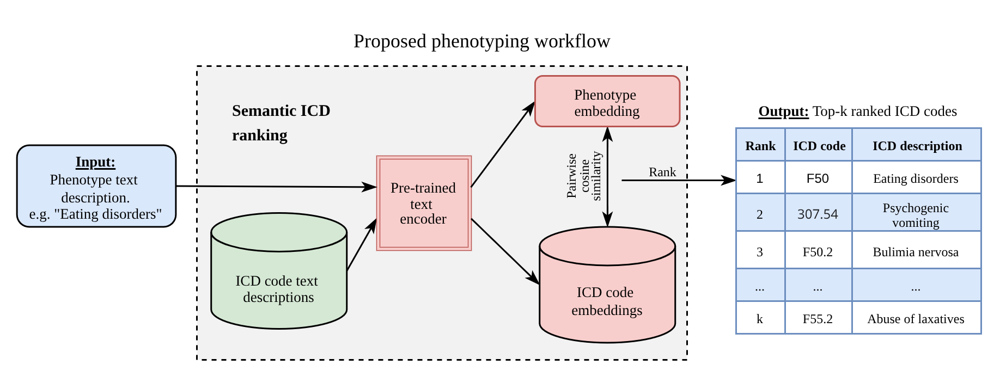

# Phecoder: semantic retrieval for auditing and expanding ICD-based phenotypes in EHR biobanks

## Overview

Phecoder maps clinical phenotypes (Phecodes) to diagnosis (ICD) codes using pretrained text embedding models. It evaluates multiple embedding models and ensemble methods to find the most relevant diagnosis codes for each phenotype.

<p align="center">
  
</p>

## Installing Phecoder
Note : python >=3.10 is required

### As a user
 ```
python -m venv venv
source venv/bin/activate
pip install git+https://github.com/DiseaseNeuroGenomics/phecoder.git
 ```

#### PyTorch with CUDA

If you want to use a GPU / CUDA, you must install PyTorch with the matching CUDA Version **before** installing Phecoder. Follow
[PyTorch - Get Started](https://pytorch.org/get-started/locally/) for further details on how to install PyTorch.

### As a developer
Phecoder is developed using Poetry. Follow [Poetry - Installation](https://python-poetry.org/docs/#installation) for further details on how to install Poetry. Then,
```
git clone https://github.com/DiseaseNeuroGenomics/phecoder.git
poetry install
```

# Quick Start

Import modules and set Hugging Face model cache:
```
import os
HUGGINGFACE_PATH = "./hf-home"
os.environ["HF_HOME"] = HUGGINGFACE_PATH
import pandas as pd
from phecoder import Phecoder
```

Define output directories:
```
output_dir = "./results/example"  # where ranked ICDs will be saved
icd_cache_dir = "./results/icd_embeddings_cache"  # where icd embeddings will be saved to avoid recomputing
```

Load ICD text descriptions:
```
icd_df = pd.read_parquet(
    "./example_data/icd_info.parquet"
)
```

Choose top-k threshold:
```
st_search_kwargs = {
    "top_k": 100,  # do not truncate ICD lists
}
```

Define list of embedding models from Hugging face:
```
models = [
    "FremyCompany/BioLORD-2023",
    "infly/inf-retriever-v1",
    "sentence-transformers/all-MiniLM-L6-v2",
    "sentence-transformers/sentence-t5-xxl",
    "sentence-transformers/multi-qa-mpnet-base-dot-v1",
    "sentence-transformers/all-MiniLM-L12-v2",
    "NeuML/pubmedbert-base-embeddings",
    "Qwen/Qwen3-Embedding-8B",
    "Qwen/Qwen3-Embedding-4B",
]
```

Phenotype text description of interest:
```
phecode_query = "Eating disorders"
```

Initialize and run Phecoder
```
pc = Phecoder(
    icd_df=icd_df,
    phecodes=phecode_query,
    models=models,
    output_dir=output_dir,
    icd_cache_dir=icd_cache_dir,
    st_search_kwargs=st_search_kwargs,
)

pc.run(overwrite=False)  # run semantic search per model

pc.build_ensemble(method="zsum")  # build ensemble with Z-sum method
```

Load results into memory:
```
from phecoder.utils import load_results

results = load_results(dir=output_dir)
```

__Support__: If you have any questions, feel free to post your question as a GitHub Issue here or send an email to jamie.bennett@mssm.edu.

__Citations__: If you use Phecoder in research, please cite our preprint on medRxiv: Bennett et al. <TBD>


