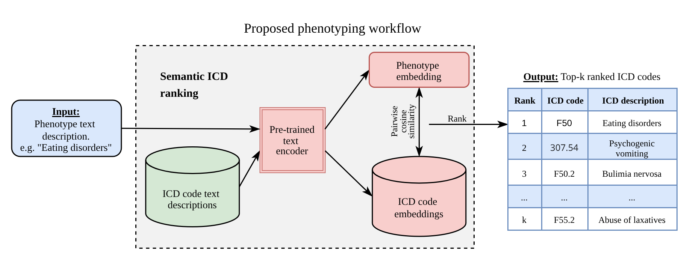

# phecoder

**Semantic retrieval for auditing and expanding ICD-based phenotypes in EHR biobanks.**

Phecoder maps clinical phenotypes (Phecodes) to diagnosis codes (ICD-9/10) using pretrained text embedding models. It ranks candidate ICD codes by semantic similarity, supports multi-model ensembles for improved recall, and includes an interactive review widget for curation and export to OHDSI ATLAS.

<p align="center">
  
</p>

## Contents
- [Installation](#installation)
- [Quick start](#quick-start)
- [Usage](#usage)
- [Interactive review & ATLAS export](#interactive-review--atlas-export)
- [Citation](#citation)

---

## Installation

```bash
pip install phecoder
```

**GPU support:** Install [PyTorch with CUDA](https://pytorch.org/get-started/locally/) *before* installing phecoder.

**Interactive review widget:**
```bash
pip install 'phecoder[review]'
```

**Developer install** (requires [Poetry](https://python-poetry.org/docs/#installation)):
```bash
git clone https://github.com/DiseaseNeuroGenomics/phecoder.git
poetry install
```

---

## Quick start

```python
import os
from phecoder import Phecoder

os.environ["HF_HOME"] = "./hf-home"   # optional: set model cache location

pc = Phecoder(
    phecodes=["Suicidal ideation", "Depression", "Anxiety"],
    output_dir="./results",
)

pc.run()
pc.build_ensemble()

results = pc.load_results("ensemble-zsum")
```

---

## Usage

### ICD data

Phecoder ships with a bundled reference ICD file and loads it automatically. You can supply your own DataFrame instead — it must contain `icd_code` and `icd_string` columns. Any additional columns (e.g. `concept_id`) are preserved through the pipeline.

```python
from phecoder import load_icd_df

icd_df = load_icd_df()   # bundled ICD-9/10 reference
```

> **Tip:** For best results, use the ICD descriptions from your own EHR/biobank dataset rather than the reference file. Semantic matching is most accurate when the strings match what your data actually contains.

### Phenotypes

The `phecodes` argument accepts a string, a list of strings, or a DataFrame:

```python
# String or list of strings — phecode IDs are assigned automatically
phecodes = "Eating disorders"
phecodes = ["Eating disorders", "Type 2 diabetes", "Hypertension"]

# DataFrame — use this to specify your own phecode IDs
import pandas as pd
phecodes = pd.DataFrame({
    "phecode":        ["250.2",          "401.1"],
    "phecode_string": ["Type 2 diabetes","Hypertension"],
})
```

### Model selection

| Preset | Description |
|---|---|
| `"preset:best_single"` | Best single model from our evaluation |
| `"preset:best_ensemble"` | Best set of models for ensemble *(default)* |

You can also pass any [SentenceTransformers](https://www.sbert.net) model ID directly:

```python
# Single model
models = "sentence-transformers/all-MiniLM-L6-v2"   # fast, ~80 MB
models = "FremyCompany/BioLORD-2023"                 # clinical text, ~440 MB

# Multiple models (for ensemble)
models = [
    "sentence-transformers/all-MiniLM-L6-v2",
    "FremyCompany/BioLORD-2023",
    "NeuML/pubmedbert-base-embeddings",
]
```

### Configuration

```python
pc = Phecoder(
    phecodes       = phecodes,
    output_dir     = "./results",
    icd_df         = icd_df,             # optional; uses bundled data if omitted
    models         = models,             # optional; defaults to preset:best_ensemble
    icd_cache_dir  = "./icd_cache",      # cache ICD embeddings for reuse across runs
    device         = None,               # "cuda" / "cpu" / None (auto-detect)
    dtype          = "float16",          # embedding storage dtype
    st_search_kwargs = {"top_k": 100},   # number of ICD codes to retrieve per phenotype
)
```

`icd_cache_dir` is useful when running multiple projects against the same ICD corpus — embeddings are computed once and reused.

### Running the pipeline

```python
# Models download automatically on first run
pc.run()

# Or pre-download explicitly (useful before batch jobs)
pc.download_models()
pc.run()
```

Results are written to `output_dir` and cached — re-running with the same inputs is a no-op unless `overwrite=True`.

### Building an ensemble

```python
# Default ensemble (reciprocal rank fusion, recommended)
pc.build_ensemble()

# Custom ensemble
pc.build_ensemble(method="rrf", method_kwargs={"k": 60}, name="ens:rrf60")
```

### Loading results

```python
# All results (individual models + ensembles)
df = pc.load_results()

# Specific model or ensemble by name
df = pc.load_results("ensemble-zsum")
df = pc.load_results(models=["ens:rrf60"], include_ensembles=True)
```

Results are returned as a long-format DataFrame with columns: `model`, `phecode`, `phecode_string`, `icd_code`, `icd_string`, `score`, `rank`.

---

## Interactive review & ATLAS export

After running the pipeline, interactively curate the top-K retrieved codes per phecode in a Jupyter notebook:

```python
session = pc.review(top_k=30, score_threshold=0.5)
session   # renders a tabbed checkbox widget — one tab per phecode
```

Save your selections in any format:

```python
session.save("picks.parquet")   # flat table with provenance
session.save("picks.json")      # nested JSON, grouped by phecode
session.save("picks.csv")
```

### Exporting to OHDSI ATLAS

ATLAS concept sets use OMOP `concept_id`s rather than raw ICD codes. Add a `concept_id` column to `icd_df` before initializing `Phecoder` and it will flow through to the export automatically:

```python
icd_df = load_icd_df()
icd_df = icd_df.merge(my_omop_concept_map, on="icd_code", how="left")

pc = Phecoder(phecodes=..., icd_df=icd_df, output_dir="./out")
pc.run()
pc.build_ensemble()

session = pc.review(top_k=30)

pc.export_atlas(session, "./atlas_concept_sets")       # one JSON per phecode
pc.export_atlas(session, "./atlas_concept_sets.json")  # single bundle
```

Import the resulting JSON in ATLAS via **Concept Sets → Import**. The exporter sets `includeDescendants=true` and `includeMapped=true` by default. OMOP concept IDs for ICD vocabularies are available from [OHDSI Athena](https://athena.ohdsi.org) (select ICD9CM, ICD10, ICD10CM, SNOMED).

---

## Citation

If you use phecoder in research, please cite:

> **Phecoder: semantic retrieval for auditing and expanding ICD-based phenotypes in EHR biobanks.**  
> Jamie J. R. Bennett, Simone Tomasi, Sonali Gupta, VA Million Veteran Program, Georgios Voloudakis, Panos Roussos, David Burstein (2026).  
> doi: [10.64898/2026.01.08.26343725](https://www.medrxiv.org/content/10.64898/2026.01.08.26343725v1)

---

**Support:** open a [GitHub Issue](https://github.com/DiseaseNeuroGenomics/phecoder/issues) or email jamie.bennett@mssm.edu.
